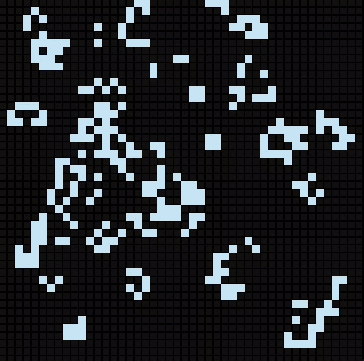
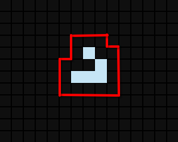
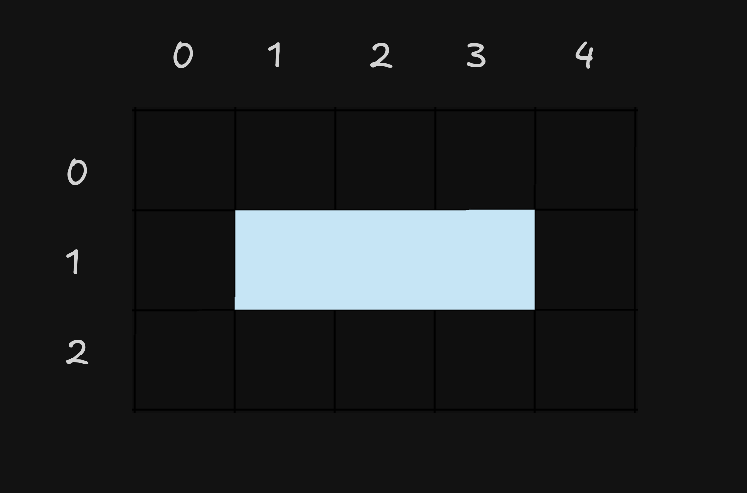

# Conway-s-game-of-life

[](https://opensource.org/licenses/MIT)
[](https://www.python.org/)
[](https://www.pygame.org/)

## Table of Contents

- [About the Project](#about-the-project)
- [Behavior](#behavior)
  - [Generations](#generations)
- [Implementation](#implementation)
- [Optimizations](#optimizations)
  - [Analyzing States](#analyzing-states)
  - [Overlapping Subproblems](#overlapping-subproblems)
- [Installation and Usage](#installation-and-usage)

## About the Project

A year ago, I stumbled upon a game called `game-of-life` created by British mathematician John Conway. I found it utterly fascinating how, with just 4 simple rules, it could simulate such complex and extraordinary behavior. Motivated and excited, I decided to implement this game using Python and Pygame to bring it to life. The result is an engaging visualization that lets us understand how the game behaves and observe the myriad of patterns that emerge from just an initial configuration of live cells.

<div>

</div>

## Behavior

The Game of Life is set in an infinite two-dimensional grid where each spot represents a cell that can be in one of 2 states: alive or dead. To determine a cell's state in the next generation, the 4 simple rules established by John Conway come into play:

- Any live cell with fewer than two live neighbors dies, as if by underpopulation.
- Any live cell with two or three live neighbors lives on to the next generation.
- Any live cell with more than three live neighbors dies, as if by overpopulation.
- Any dead cell with exactly three live neighbors becomes a live cell, as if by reproduction.

These rules mirror natural systems in compelling ways—cells die from isolation or overcrowding, yet new life emerges when local conditions are just right. That is why it is named the Game of Life: it simulates life, determining survival through just four elementary rules.

#### Generations

The game progresses through generations—each generation is an iteration of the current state of the world where applying the rules produces a new pattern. You can run through as many generations as you like, or let them compute indefinitely. But does execution ever stop? Yes. Depending on the initial setup, a simulation may reach a state where every cell dies; this is considered a terminal state. Alternatively, an initial configuration can lead to endless generations if it enters a repeating state where a set of live cells forms a cyclic pattern that lives and dies in a loop—known as an oscillator or cyclic structure.

## Implementation

For practical purposes, this project models a finite world of size $N \times M$. The world is represented as a matrix where each position holds a cell's state (0 represents a dead cell and 1 represents a live cell). During each iteration (generation), we inspect the adjacent neighbors—including diagonals—for every cell to determine its next state. The logic and game rules are implemented in a Python engine, while Pygame handles the visual rendering.

## Optimizations

### Analyzing States

While testing setups on larger finite grids, I noticed that computational overhead grew rapidly with world size. For large grids, evaluating every $N \times M$ cell each turn caused severe performance slowdowns. For instance, a $10000 \times 10000$ matrix requires evaluating 100,000,000 cells every generation, yielding a time complexity of $O(N \times M)$ (or $O(N^2)$ for square matrices).

<div>

<p style="text-align: center">25x25 Matrix, Live cells: 5</p>
</div>

##### Solution

Looking closely at the problem raised a natural question: *What if we don't need to scan the entire world?*

Instead of checking all $N \times M$ positions, we can restrict our focus to the areas most likely to change state: **live cells and their immediate neighborhood**. Concentrating on live cells (since they drive neighbor transitions) reduces scanning the entire grid down to tracking $N$ live cells per generation ($O(N)$).

Instead of processing the entire board, we only inspect the $3 \times 3$ neighborhood (9 candidate cells) around each live cell. To decide whether each candidate lives or dies in the next generation, we evaluate its own $3 \times 3$ (9) neighbors. This yields an upper bound of $N \times (3 \times 3) \times (3 \times 3) = 81N$ operations per generation.

<div>

<p style="text-align: center">Bounded search area</p>
</div>

##### Practical Example

Taking the generation pictured above in a $25 \times 25$ world (625 total positions) with only 5 live cells ($N = 5$):

- **Traditional approach:** Evaluates all $625$ matrix cells.
- **Live-cell focused approach:** Evaluates $5 \text{ cells} \times 9 \text{ candidates} \times 9 \text{ neighbors} = 405 \text{ operations}$.

Since $405 < 625$, this approach significantly reduces the total operations per cycle.

#### Side Effects

It is worth noting a few edge cases:

- **High live-cell density:** As the number of live cells $N$ grows, $81N$ increases and can eventually exceed the cost of scanning the entire grid. Fortunately, due to Conway's rules, sustained high density across an entire large grid is rare in practice.
- **Inefficiency on small or dense boards:** In a $10 \times 10$ board (100 total cells) with 5 live cells, $5 \times 81 = 405$ operations. Here, $405 > 100$, causing redundant re-evaluations that outweigh full-board scanning.

We solve this inefficiency using **dynamic programming**.

---

### Overlapping Subproblems

Focusing on live cells reduces unnecessary work, but overlapping neighborhoods still introduce redundant checks when live cells sit close together:

<div>

<p style="text-align: center;">3x5 Matrix, Live cells: 3</p>
</div>

In this $3 \times 5$ mini-world, live cells reside at positions `(1,1)`, `(1,2)`, and `(1,3)`. Evaluating cell `(1,1)` checks all positions it can influence, including itself: `(0,0), (0,1), (0,2), (1,0), (1,1), (1,2), (2,0), (2,1), (2,2)`.

The algorithm evaluates these coordinates to compute their next-generation state:

```text
(0,0) -> 0
(0,1) -> 0
(0,2) -> 1
(1,0) -> 0
(1,1) -> 0
(1,2) -> 1
(2,0) -> 0
(2,1) -> 0
(2,2) -> 1

```

Next, evaluating live cell `(1,2)` targets its neighbors: `(0,1), (0,2), (0,3), (1,1), (1,2), (1,3), (2,1), (2,2), (2,3)`:

```text
(0,1) -> 0 <- Duplicate
(0,2) -> 1 <- Duplicate
(0,3) -> 0
(1,1) -> 0
(1,2) -> 1 <- Duplicate
(1,3) -> 0
(2,1) -> 0
(2,2) -> 1 <- Duplicate
(2,3) -> 0

```

Several positions are re-calculated because they overlap with the neighborhood of `(1,1)`.

#### Solution

To eliminate these duplicate calculations, we apply a **dynamic programming pattern (top-down with memoization)**.

As each candidate cell is processed, its coordinate is added to a **`set()`**. In subsequent checks, we query the set to see if the position was already evaluated during the current generation. This ensures each candidate position is calculated **exactly once** per tick.

## Installation and Usage

To run and view the simulation locally, follow these steps:

### Prerequisites

Ensure you have installed:

* **Python 3.x** (preferably 3.12 or higher).
* **Pip** (Python package manager).

### Installation Steps

1. **Clone this repository:**

```bash
git clone [https://github.com/suaadev/conway-s-game-of-life.git](https://github.com/suaadev/conway-s-game-of-life.git)
cd conway-s-game-of-life

```

2. **Create a virtual environment (Recommended):**

```bash
python -m venv venv

# On Windows:
venv\Scripts\activate

# On macOS and Linux:
source venv/bin/activate

```

3. **Install dependencies:**
This project relies on `pygame` for graphics rendering and `numpy`.

```bash
pip install -r requirements.txt

```

### Execution

To launch the GUI and run the simulation:

```bash
python src/main.py

```

### Controls

* **Left Click:** Place a live cell.
* **Right Click:** Remove a live cell.
* **S Key:** Start / Pause simulation.
* **C Key:** Clear board and reset world.
* **B Key:** Toggle grid visibility.
* **M Key:** Decrease time between generations (faster).
* **N Key:** Increase time between generations (slower).
